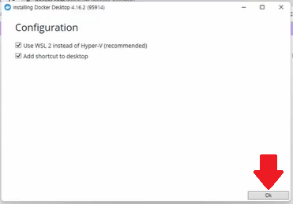
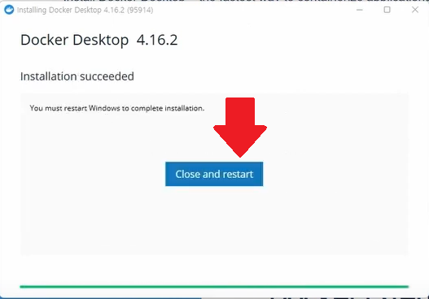
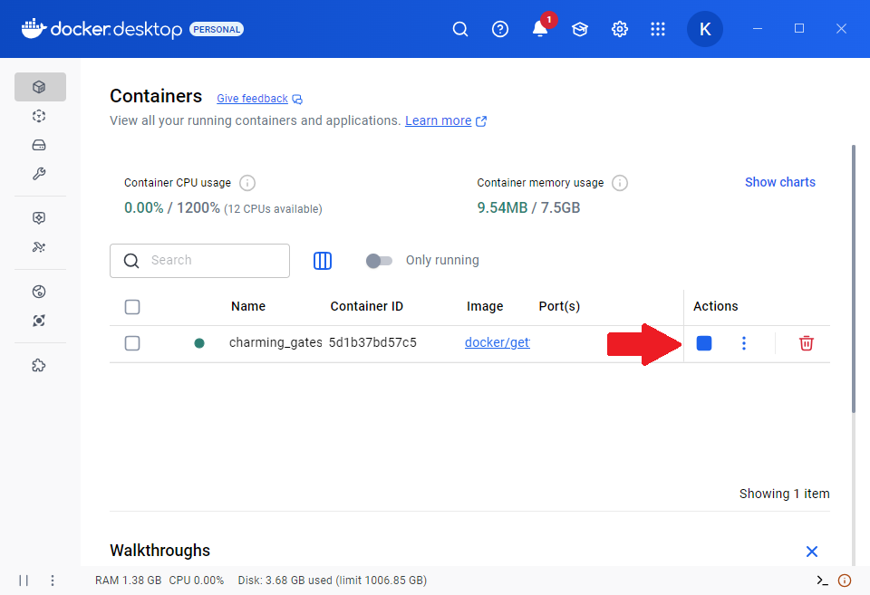
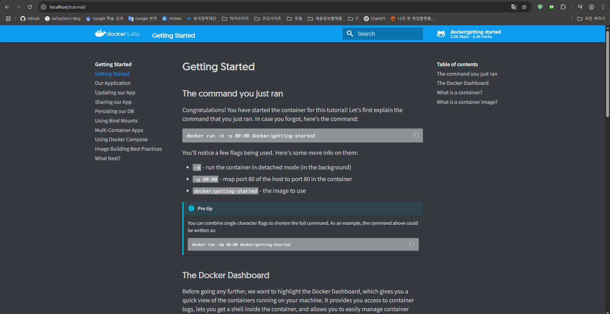

## 도커 입문 2강 - 도커, 도커컴포즈, 도커허브

* [Youtube](https://youtu.be/YmcgYejtGAg?si=yrPFvQPqIWsKktom)

* 도커 : 프로그램이 들어갈 컨테이너를 만들어줌
컨테이너 : OS와 근사한 기능을 제공

* docker-compose : 2개 이상의 컨테이너간 결합 실행을 지원

* docker-hub : github와 유사. 컨테이너를 업로드하는 클라우드 공간

## 도커 입문 3강 - 도커, 도커 허브 설치 및 도커허브 회원가입

* [Youtube](https://youtu.be/mb4Xln-v8xc?si=2IHOe22B6SYMmfil)

* [Docker Desktop for Window 설치](https://www.docker.com/products/docker-desktop/)

주의사항 : 윈도우 10 이상 pro 버전만 설치 가능

1. 

2. 

3. 제어판, 프로그램(프로그램 보기), Window 기능 켜기/끄기, Hyper-V 체크 해제, Linux용 Window 하위 시스템 체크

4. Window+R 키 입력, cmd 입력, cmd 창에 커서 올리고 

```
docker run -d -p 80:80 docker/getting-started
```

입력

5. 생성된 컨테이너가 작동중(■)인지 확인

6. chrome 주소창에 localhost 입력

7. 

* [Docker Compose for Windows 설치](https://docs.docker.com/compose/install/standalone/)

1. PowerShell 관리자 권한으로 실행

2. 커서 올리고 아래 명령어 입력

``` 
Start-BitsTransfer -Source "https://github.com/docker/compose/releases/download/v2.38.1/docker-compose-windows-x86_64.exe" -Destination $Env:ProgramFiles\Docker\docker-compose.exe
```

3. 설치 후, 아래 명령어 입력하여 정상적으로 설치되었는 지 확인

```
docker compose version
```

* [Docker Hub 가입](https://hub.docker.com/)